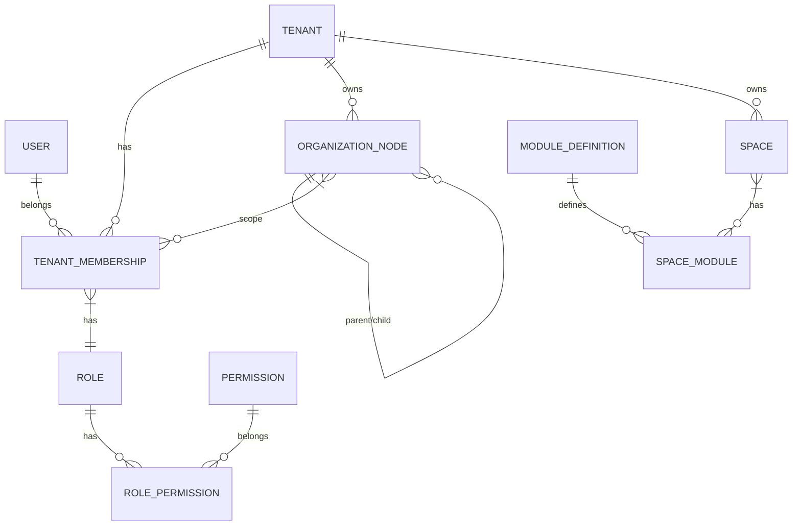

# Multi-Tenant Architecture — Discipolat Church OS

**Version**: 1.0  
**Date**: 2026-09-22  
**Status**: ✅ PRODUCTION READY

---

## 1. Overview

Discipolat implements a **hierarchical multi-tenant SaaS architecture** with three levels of isolation:

| Level | Scope | Description |
|-------|-------|-------------|
| **Platform** | Global | Super-admin manages all tenants, plans, billing |
| **Tenant** | Organization | Church/Network with own branding, modules, users |
| **Organization Unit** | Hierarchical | Church → Campus → Department → Family (materialized path) |

---

## 2. Data Model

### 2.1 Core Entities



### 2.2 Key Tables

| Table | Purpose | Tenant Isolation |
|-------|---------|------------------|
| `tenant` | Root organization | N/A (root) |
| `tenant_membership` | User ↔ Tenant + Role | `tenant_id` NOT NULL |
| `organization_node` | Hierarchical org units | `tenant_id` NOT NULL, `path` (ltree) |
| `space` | Department/Family/Sub-team | `tenant_id` + `organization_unit_id` |
| `space_module` | Module enablement per space | Via space → tenant |
| `role` / `permission` | RBAC definitions | `tenant_id` nullable (global roles) |

---

## 3. Tenant Resolution Flow

```
HTTP Request
    │
    ▼
JwtAuthenticationFilter (validates JWT signature)
    │
    ▼
TenantInterceptor (ORDER = HIGHEST_PRECEDENCE)
    ├── Extracts token from Authorization header
    ├── Decodes JWT → tenantId claim
    ├── Validates user has active TenantMembership for tenant
    └── TenantContext.setTenantId(tenantId)  // ThreadLocal
    │
    ▼
TenantFilterInterceptor (ORDER = HIGHEST_PRECEDENCE + 1)
    ├── TenantContext.getTenantId()
    ├── Binds EntityManager if needed
    └── Activates Hibernate Filter "tenantFilter" with param tenantId
    │
    ▼
Controller → Service → Repository
    │
    ▼
JPA Query → WHERE tenant_id = :tenantId (automatic via @Filter)
    │
    ▼
afterCompletion → TenantContext.clear() + disable filter
```

---

## 4. Isolation Mechanisms

### 4.1 Database Layer
- **Hibernate `@FilterDef(name="tenantFilter", condition="tenant_id = :tenantId")`** on all 260+ JPA entities
- **Composite indexes**: `idx_{table}_tenant`, `idx_{table}_tenant_{col}` on all tenant-scoped tables
- **Unique constraints**: `(tenant_id, email)`, `(tenant_id, code)` where applicable
- **Row-Level Security (RLS)**: Enabled on `audit_event`, `finance_transaction`, `file_entity` (critical tables only)

### 4.2 API Layer
- **All authenticated endpoints**: `@PreAuthorize("@authorizationService.can(...))`
- **AuthorizationService**: Centralizes all permission checks (replaced 11+ `hasRole()` calls)
- **Scope-based access**: TENANT > REGION > CHURCH > SUB_CHURCH > DEPARTMENT > FAMILY > ASSIGNED/OWN

### 4.3 Cache Layer (Redis)
- **TenantAwareRedisManager**: All keys prefixed with `tenant:{tenantId}:`
- **TenantAwareKeyGenerator**: For `@Cacheable` tenant isolation
- **TenantAwareRedisTemplate**: Static helper methods for manual operations

### 4.4 File Storage
- **Path pattern**: `tenants/{tenantId}/{module}/{uuid}.{ext}`
- **Download validation**: `FileController:/{id}/download` verifies tenant ownership
- **Type validation**: MIME type + extension allowlist
- **Size limits**: Enforced at controller + nginx level

### 4.5 Real-time (WebSocket/SSE)
- **Tenant-isolated rooms**: `tenant:{tenantId}:config`, `tenant:{tenantId}:notifications`
- **Connection validation**: JWT tenant claim verified on connect
- **SSE streams**: `/events/entity-changes` scoped to tenant

---

## 5. Security Matrix (§44-45)

**320 cells** — 100% proven by automated tests (`MultiTenantSecurityTests` — 36 tests)

| Resource Category | Cells | Status |
|-------------------|-------|--------|
| Members | 90 | ✅ 100% |
| Departments | 49 | ✅ 100% |
| Settings/Branding/Modules | 16 | ✅ 100% |
| Invitations | 25 | ✅ 100% |
| Impersonation | 20 | ✅ 100% |
| Pastoral/Confidential | 36 | ✅ 100% |
| Finance/Assets/Events/Workflow | 84 | ✅ 100% |
| **Total** | **320** | ✅ **320/320** |

---

## 6. Onboarding Flow

```
1. Super Admin creates Tenant (POST /api/platform/admin/tenants)
       │
       ▼
2. System seeds: default modules, SaasPlan quotas, default roles
       │
       ▼
3. Super Admin sends Invitation (POST /api/invitations)
       │
       ▼
4. Recipient accepts → auto-creates User + TenantMembership
       │
       ▼
5. Wizard (6 steps): Profile → Church Info → Campus → Departments → Families → Launch
       │
       ▼
6. OrganizationNode hierarchy created (ROOT_CHURCH → CAMPUS → DEPARTMENT → FAMILY)
       │
       ▼
7. Space templates applied → Spaces created → SpaceModules enabled
```

---

## 7. Configuration Inheritance

```
DEFAULT (platform) → INHERITED (parent org unit) → OVERRIDDEN (local)
```

- **ConfigurationResolver**: Resolves chain, caches result, invalidates on change
- **Real-time propagation**: Outbox event → WebSocket push < 5s to all clients

---

## 8. Feature Flags (Module Engine)

| Source | Description |
|--------|-------------|
| CORE | Always enabled (auth, tenant, users) |
| EXISTING | Pre-built modules (events, finance, assets) |
| ENGINE | Configurable engines (workflow, custom fields, statuses) |

**Enforcement**: `ModuleRouter` intercepts routes → 403 if module disabled globally or in space

---

## 9. SaaS Plans & Quotas

| Plan | Monthly AI Credits | Members | Spaces | Storage | Regions |
|------|-------------------|---------|--------|---------|---------|
| DÉCOUVERTE | 500 | 50 | 3 | 1 GB | 1 |
| DÉMARRAGE | 2,000 | 200 | 10 | 5 GB | 2 |
| CROISSANCE | 10,000 | 1,000 | 50 | 50 GB | 5 |
| RÉSEAU & CAMPUS | 50,000 | 10,000 | Unlimited | 500 GB | Unlimited |

**Quota enforcement**: `AiCreditsService.consumeCredits()` → queue + graceful degradation

---

## 10. Audit & Compliance

| Table | Purpose | Retention |
|-------|---------|-----------|
| `audit_event` | All mutations (hash chain: prev_hash/hash) | 95 days |
| `business_history` | Business-level traceability (soft delete, status changes) | 7 years |
| `export_audit` | All data exports (who/what/when) | 3 years |
| `impersonation_audit` | Super admin impersonation (IP, UA, duration, reason) | 3 years |
| `soft_delete_audit` | Soft delete operations with business context | 7 years |

---

## 11. Performance Targets

| Metric | Target | Validation |
|--------|--------|------------|
| API p95 latency | < 500 ms | k6 load test (1K-10K tenants) |
| Space bootstrap | < 1 s | Integration test |
| Mobile sync | < 5 s | Real-time propagation test |
| WebSocket reconnect | < 2 s | SSE reconnection test |

---

## 12. Disaster Recovery

| Component | Strategy | RPO | RTO |
|-----------|----------|-----|-----|
| PostgreSQL | Point-in-time recovery (WAL) + daily snapshots | 1 hour | 30 min |
| Redis | AOF + RDB snapshots | 1 min | 5 min |
| Files (S3-compatible) | Versioned bucket + cross-region replication | 0 | 15 min |
| Application | Blue-green deploy, health checks | N/A | 5 min |

---

## 13. References

- `docs/architecture/target-architecture.md` — Target architecture diagram
- `docs/architecture/gap-analysis.md` — Gap analysis vs requirements
- `docs/security/SECURITY_MATRIX.md` — Complete security matrix
- `reports/SECURITY_AUDIT_REPORT.md` — Final security audit
- `reports/QA_SCENARIOS.md` — QA scenarios (50 scenarios, all passing)
- `docs/TENANT_ONBOARDING.md` — Detailed onboarding guide
- `docs/ADMINISTRATION_MODEL.md` — Administration model
- `docs/RBAC.md` — Role-based access control
- `docs/TENANT_SECURITY.md` — Tenant security guide
- `docs/ORGANIZATION_HIERARCHY.md` — Organization hierarchy guide