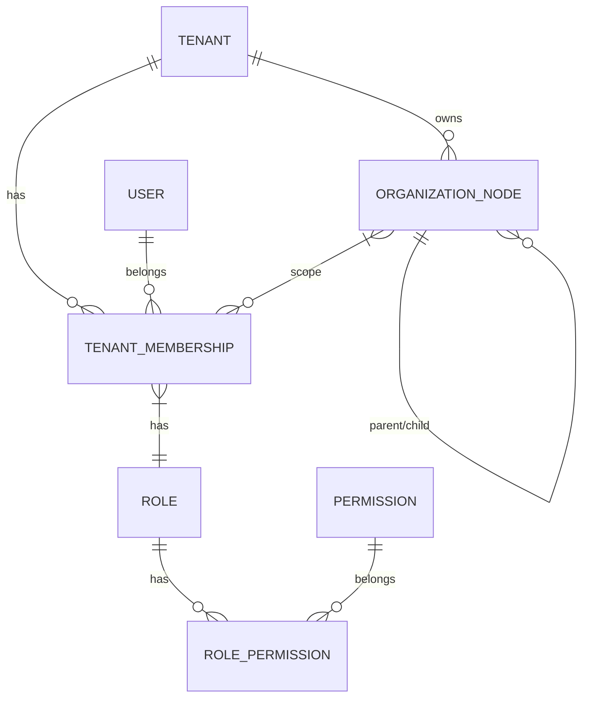

# MULTI-TENANT ARCHITECTURE AUDIT
## Discipolat — Transformation en Plateforme SaaS Multi-Tenant Hiérarchique

**Date**: 2026-09-10  
**Version**: 1.0  
**Statut**: Audit initial — Avant toute modification

---

## 1. ARCHITECTURE ACTUELLE

### 1.1 Stack Technique
| Couche | Technologie |
|--------|-------------|
| Backend | Java 21, Spring Boot 3.x, Spring Data JPA, Hibernate |
| Base de données | PostgreSQL (Flyway migrations) |
| Cache | Redis (Spring Cache, Redisson) |
| Authentification | JWT (RS256), Access 15min / Refresh 7j |
| Frontend Web | React 18, TypeScript, Vite, TanStack Query, Zustand |
| Mobile | Flutter 3.x, Dart, Drift (SQLite), Riverpod |
| Infrastructure | Docker, Nginx, Render/Cloud, GitHub Actions |

### 1.2 Structure du Projet Backend
```
com.discipolat
├── common/
│   ├── multitenancy/          # Infrastructure multi-tenant (ThreadLocal, Hibernate Filter)
│   ├── infrastructure/security/  # JWT, Rate limiting, Security config
│   └── exception/             # Exceptions métier
├── modules/
│   ├── tenants/               # Tenant CRUD basique (1 entity, 1 controller)
│   ├── authentication/        # Login, register, tokens, magic links
│   ├── users/                 # User entity + roles (ADMIN, PASTEUR, RESPONSABLE, CHEF_DE_FAMILLE, FAISEUR, MEMBRE)
│   ├── families/              # Families (chef, membres)
│   ├── departments/           # Departments (responsable, membres)
│   ├── souls/                 # Disciples/Ames (faiseur, famille, département)
│   └── 100+ autres modules... # Events, finances, notifications, etc.
```

### 1.3 Modèle de Données Actuel (Extrait)

| Entité | Clé primaire | tenant_id | Isolation |
|--------|--------------|-----------|-----------|
| `tenants` | UUID | N/A | Table racine |
| `users` | UUID | OUI (NOT NULL) | Hibernate Filter |
| `souls` | UUID | OUI (NOT NULL) | Hibernate Filter |
| `families` | UUID | OUI (NOT NULL) | Hibernate Filter |
| `departments` | UUID | OUI (NOT NULL) | Hibernate Filter |
| *Tous modules métier* | UUID | OUI (NOT NULL) | Hibernate Filter |

**Total tables avec tenant_id**: ~85 tables (migration V70)

---

## 2. MÉCANISME MULTI-TENANT EXISTANT

### 2.1 Flux de Résolution du Tenant
```
Requête HTTP
    │
    ▼
JwtAuthenticationFilter (valide JWT)
    │
    ▼
TenantInterceptor (ORDER = HIGHEST_PRECEDENCE)
    ├── Extrait token du header Authorization
    ├── Décode JWT → tenantId claim
    └── TenantContext.setTenantId(tenantId)  // ThreadLocal
    │
    ▼
TenantFilterInterceptor (ORDER = HIGHEST_PRECEDENCE + 1)
    ├── TenantContext.getTenantId()
    ├── Crée/bind EntityManager si nécessaire
    └── Active Hibernate Filter "tenantFilter" avec param tenantId
    │
    ▼
Controller / Service / Repository
    │
    ▼
Requête JPA → WHERE tenant_id = :tenantId (automatique via @Filter)
    │
    ▼
afterCompletion → TenantContext.clear() + disable filter
```

### 2.2 Points Clés
- **ThreadLocal** : `TenantContext.CURRENT_TENANT` (UUID)
- **Default Tenant** : `00000000-0000-0000-0000-000000000001` (fallback jobs/scheduled)
- **Hibernate Filter** : `@FilterDef(name="tenantFilter", condition="tenant_id = :tenantId")` sur chaque entité
- **Index composites** : `idx_{table}_tenant`, `idx_{table}_tenant_{col}` (V70 lignes 380-418)
- **Contrainte unique** : `uk_users_tenant_email` (tenant_id, email)

### 2.3 Authentification & JWT
```java
// JwtTokenProvider.generateAccessToken()
claims.put("tenantId", tenantId.toString());  // Inclus si non-null

// TenantInterceptor.extractTenantId()
getClaims(token).get("tenantId", String.class);
```

---

## 3. FAILLES POTENTIELLES & RISQUES IDENTIFIÉS

### 3.1 Architecture & Modèle
| # | Risque | Gravité | Description |
|---|--------|---------|-------------|
| 1 | **Pas de SUPER_ADMIN** | CRITIQUE | Niveau plateforme absent. Seuls admins de tenant existent. |
| 2 | **User = Single Tenant** | CRITIQUE | `User.tenant_id` direct → impossible d'appartenir à plusieurs tenants (ex: pasteur réseau) |
| 3 | **Pas de TenantMembership** | CRITIQUE | Pas de séparation User ↔ Appartenance → pas de rôles par tenant |
| 4 | **Pas d'OrganizationNode** | HAUTE | Pas de hiérarchie église/campus/sous-église/département/groupe |
| 5 | **RBAC basique seulement** | HAUTE | 6 rôles fixes, pas de permissions fines, pas de portée (GLOBAL/TENANT/CHURCH/OWN) |
| 6 | **Pas de Feature Flags** | HAUTE | Modules activés/désactivés par tenant absents |
| 7 | **Pas de Plans/Quotas SaaS** | HAUTE | FREE/STARTER/PRO/ENTERPRISE non modélisés |
| 8 | **Pas de Branding/Tenant Settings** | MOYENNE | Logo, couleurs, timezone, langue, devise par tenant absents |

### 3.2 Sécurité & Isolation
| # | Risque | Gravité | Description |
|---|--------|---------|-------------|
| 9 | **Default Tenant Fallback** | CRITIQUE | `TenantAutoSetListener` utilise DEFAULT_TENANT_ID si contexte absent → écritures silencieuses cross-tenant possibles dans jobs |
| 10 | **Pas de vérification Membership** | CRITIQUE | Aucune validation que l'utilisateur appartient bien au tenant du JWT |
| 11 | **TenantId depuis JWT uniquement** | CRITIQUE | Pas de validation côté serveur que le user a accès à ce tenant |
| 12 | **Pas de tests Cross-Tenant** | CRITIQUE | Aucune suite `CrossTenantSecurityTest` |
| 13 | **Cache keys non isolés** | HAUTE | Risque collision `user:123` entre tenants |
| 14 | **WebSocket rooms non isolées** | HAUTE | `chat:general` possible au lieu de `tenant:A:chat` |
| 15 | **Fichiers non isolés par tenant** | HAUTE | Stockage sans préfixe `tenants/{tenantId}/` |
| 16 | **Notifications non tenant-aware** | MOYENNE | User multi-tenant recevrait notifs de tous tenants |

### 3.3 API & Backend
| # | Risque | Gravité | Description |
|---|--------|---------|-------------|
| 17 | **Repositories dangereux** | CRITIQUE | `findById(id)` sans tenant check possible → IDOR |
| 18 | **Controllers sans tenant validation** | HAUTE | Pas de couche centralisée `findByIdAndTenant()` |
| 19 | **Pas d'audit log centralisé** | HAUTE | Module `audit` existe mais couverture incomplète |
| 20 | **Impersonation Super Admin absente** | MOYENNE | Pas de mécanisme contrôlé/audité |

### 3.4 Frontend & Mobile
| # | Risque | Gravité | Description |
|---|--------|---------|-------------|
| 21 | **Frontend: Pas de TenantContext** | HAUTE | Aucun état tenant global, pas de sélecteur d'organisation |
| 22 | **Frontend: User type sans tenantId** | HAUTE | `User` interface ne contient pas tenantId |
| 23 | **Mobile: TenantConfig basique** | MOYENNE | `X-Org-Id` header mais pas de validation backend |
| 24 | **Mobile: Drift/SQLite sans tenant** | HAUTE | Cache local `member:123` sans tenant context |

### 3.5 Données & Migration
| # | Risque | Gravité | Description |
|---|--------|---------|-------------|
| 25 | **Migration V70: Default tenant unique** | HAUTE | Toutes données existantes → 1 seul tenant "Discipolat (Default)" |
| 26 | **Pas de stratégie migration multi-tenant** | HAUTE | Comment splitter données existantes par organisation réelle ? |
| 27 | **Email unique global → par tenant** | MOYENNE | V70 change contrainte mais données existantes peuvent avoir doublons cross-tenant |

---

## 4. ENDPOINTS DANGEREUX (Échantillon)

### 4.1 Endpoints sans vérification tenant explicite
```
GET    /api/v1/users/{id}                    → UserRepository.findById(id)
GET    /api/v1/souls/{id}                    → SoulRepository.findById(id)
GET    /api/v1/families/{id}                 → FamilyRepository.findById(id)
GET    /api/v1/departments/{id}              → DepartmentRepository.findById(id)
GET    /api/v1/reports/maker/{id}            → MakerReportRepository.findById(id)
GET    /api/v1/files/{id}                    → FileRepository.findById(id)
GET    /api/v1/events/{id}                   → EventRepository.findById(id)
POST   /api/v1/transfers                     → TransferService.create (personneId sans check tenant)
```

### 4.2 Repositories exposant findById sans tenant
- `UserRepository.findById(UUID)`
- `SoulRepository.findById(UUID)`
- `FamilyRepository.findById(UUID)`
- `DepartmentRepository.findById(UUID)`
- `EventRepository.findById(UUID)`
- `FileRepository.findById(UUID)`
- + 80+ autres repositories

> **Note**: Le Hibernate Filter protège *si* le contexte est bien posé. Mais :
> - Jobs planifiés sans contexte → DEFAULT_TENANT_ID
> - Webhooks publics sans auth → pas de filtre
> - Tests `@WebMvcTest` sans `TenantFilter` bean → pas de filtre
> - `EntityManager` direct / native queries → bypass filter

---

## 5. STRATÉGIE RECOMMANDÉE

### 5.1 Choix d'Isolation : Option A (tenant_id partout) + Option B (RLS) hybride
| Approche | Avantages | Inconvénients | Décision |
|----------|-----------|---------------|----------|
| **A: tenant_id colonne + Hibernate Filter** | Simple, explicite, testable, performant, fonctionne avec connection pooling | Dev discipline required | **RECOMMANDÉ** (déjà en place, à renforcer) |
| **B: PostgreSQL RLS** | Sécurité au niveau DB, impossible à bypass | Complexité pooling, migrations, debug difficile | **Évaluer pour tables critiques seulement** (audit_logs, finances) |
| **C: Schéma par tenant** | Isolation totale | Coûteux, migrations complexes, pas scalable 1000+ tenants | **EXCLU** |

**Recommandation**: Conserver **Option A** comme base, durcir :
1. Interdire `findById` nu → imposer `findByIdAndTenantId` via interface `TenantAwareRepository`
2. Ajouter `@PreAuthorize("@tenantSecurity.checkAccess(#id)")` sur controllers
3. Activer RLS **uniquement** sur `audit_logs`, `finance_transactions`, `files` (données sensibles)

### 5.2 Modèle de Données Cible



**Nouvelles entités requises** :
1. `TenantMembership` (user_id, tenant_id, role, status, joined_at)
2. `Role` (key, label, description, system, tenant_id nullable pour rôles globaux)
3. `Permission` (key, label, scope: GLOBAL|TENANT|CHURCH|SUB_CHURCH|DEPARTMENT|FAMILY|OWN)
4. `RolePermission` (role_id, permission_id)
5. `OrganizationNode` (id, tenant_id, parent_id, type, name, code, path, level, metadata)
6. `TenantSettings` (tenant_id, branding_json, features_json, locale, timezone, currency)
7. `SaasPlan` (key, name, limits_json, price, stripe_price_id)
8. `TenantSubscription` (tenant_id, plan_key, status, current_period_end, quotas_json)
9. `Invitation` (token, tenant_id, email, role, scope, inviter_id, expires_at)
10. `AuditLog` (actor_id, tenant_id, action, resource, resource_id, result, metadata, timestamp)

### 5.3 Ordre Exact des 20 Slices (selon tenant.md #49)

| Slice | Titre | Durée estimée | Dépendances |
|-------|-------|---------------|-------------|
| **1** | **Audit + architecture multi-tenant** | ✅ FAIT (ce doc) | — |
| **2** | **Tenant model + migration** | 3j | 1 |
| **3** | **Tenant context** (centralisé, sélection explicite multi-tenant) | 2j | 2 |
| **4** | **Membership** (User ↔ TenantMembership, multi-appartenance) | 3j | 2,3 |
| **5** | **RBAC** (Role, Permission, RolePermission, scope) | 4j | 4 |
| **6** | **Tenant isolation** (TenantAwareRepository, IDOR tests, cache keys) | 3j | 3,5 |
| **7** | **Organization hierarchy** (OrganizationNode, path, level, materialized path) | 4j | 2,4 |
| **8** | **Tenant settings** (branding, locale, timezone, currency, config JSON) | 2j | 2 |
| **9** | **Feature flags** (per tenant, backend enforcement) | 2j | 8 |
| **10** | **Tenant onboarding** (wizard 12 étapes, web) | 3j | 2,8,9 |
| **11** | **Super Admin** (platform level, impersonation auditée, dashboard) | 4j | 2,5,6 |
| **12** | **Tenant Admin dashboard** (KPIs tenant-scoped) | 2j | 5,7 |
| **13** | **Sub-church management** (CRUD OrganizationNode type CHURCH/CAMPUS/SUB_CHURCH) | 3j | 7,11 |
| **14** | **Frontend tenant switching** (TenantContext, selector, routing) | 3j | 3,4 |
| **15** | **Flutter multi-tenant** (org switcher, offline isolation, Drift tenant_id) | 3j | 3,4,16 |
| **16** | **Offline tenant isolation** (Drift schema + tenant_id, cache clear on switch) | 2j | 4,15 |
| **17** | **Audit logging** (global, structured, searchable) | 2j | 11 |
| **18** | **Security tests** (CrossTenantSecurityTest suite, IDOR automation) | 3j | 6,11 |
| **19** | **Production hardening** (RLS eval, rate limits, monitoring, docs) | 3j | 1-18 |
| **20** | **Documentation & Go-live checklist** | 2j | 19 |

**Total estimé**: ~50 jours / 10 semaines

---

## 6. PLAN DE MIGRATION DONNÉES EXISTANTES (tenant.md #43)

### 6.1 Étapes
1. **Backup complet** (pg_dump + verification)
2. **Identifier organisations réelles** dans données actuelles (analyser `users`, `church_settings`, `families` clusters)
3. **Créer tenant initial** par organisation détectée (pas 1 seul "Default")
4. **Associer données historiques** : UPDATE tenant_id par cluster métier
5. **Créer User + TenantMembership** pour chaque user existant
6. **Créer OrganizationNode** racine (ROOT_CHURCH) par tenant
7. **Mapper familles/départements/souls** vers OrganizationNode appropriés
8. **Vérifier intégrité** : comptes, contraintes, indexes
9. **Tests non-régression** : auth, users, families, souls, reports, notifications, dashboard, transfers, audit
10. **Migration contrôlée** : canary → progressif → full

### 6.2 Tenant Initial
- **NE PAS** garder "Discipolat (Default)" unique
- Créer **un tenant par organisation réelle** détectée
- Marquer l'ancien default comme `LEGACY` → à supprimer post-migration

---

## 7. CHECKLIST DEFINITION OF DONE (tenant.md #52)

Pour chaque slice/fonctionnalité :
- [ ] DB (migration Flyway)
- [ ] Migration données
- [ ] Backend (entities, repositories, services)
- [ ] API (controllers, DTOs, validation)
- [ ] Authentication (JWT claims, tenant resolution)
- [ ] Authorization (permissions, scopes)
- [ ] Tenant isolation (Hibernate filter + repository guards)
- [ ] IDOR tests (automatisés)
- [ ] Frontend (components, context, routing)
- [ ] Mobile (si concerné: models, offline, sync)
- [ ] Cache isolation (Redis keys tenant-prefixed)
- [ ] Notifications isolation (tenant-aware)
- [ ] Files isolation (storage path tenant-prefixed)
- [ ] Tests (unit, integration, cross-tenant)
- [ ] Documentation (OpenAPI, README, ADR)
- [ ] Build (compile, test, lint)
- [ ] Fonctionnement réel (manuel E2E)
- [ ] Git commit (conventional commits)

---

## 8. RÈGLES CRITIQUES (tenant.md #53) — À APPLIQUER IMMÉDIATEMENT

> **JAMAIS** considérer comme preuve d'autorisation :
> - `tenantId` présent dans la requête (body/query/header)
> - `tenantId` présent dans le frontend
> - Bouton caché dans l'UI
> - Utilisateur connaît l'ID

> **TOUJOURS** vérifier côté backend :
> 1. **IDENTITÉ** : User authentifié (JWT valide)
> 2. **MEMBERSHIP** : User appartient au tenant (TenantMembership actif)
> 3. **TENANT** : Contexte tenant résolu côté serveur
> 4. **PERMISSION** : Rôle + Permission + Portée autorisent l'action
> 5. **RESOURCE OWNERSHIP** : Ressource appartient au tenant/contexte

---

## 9. PROCHAINES ÉTAPES IMMÉDIATES

1. **Valider cet audit** avec l'équipe
2. **Créer branches** : `feature/multi-tenant-slice-{1..20}`
3. **Slice 2** : Étendre modèle Tenant + créer TenantMembership, Role, Permission, OrganizationNode
4. **Slice 3** : Refactor `TenantContext` → support sélection explicite + `CurrentTenantResolver` unifié
5. **Paralléliser** : Slices 4-6 peuvent avancer ensemble (backend core)

---

## 10. ANNEXES

### A. Fichiers Clés à Modifier (Backend)
```
/common/multitenancy/TenantContext.java
/common/multitenancy/TenantFilter.java
/common/multitenancy/TenantInterceptor.java
/common/multitenancy/TenantFilterIntegrator.java
/common/multitenancy/TenantAwareRepository.java
/common/multitenancy/CurrentTenantResolver.java
/common/infrastructure/security/JwtTokenProvider.java
/modules/tenants/domain/Tenant.java
/modules/tenants/domain/TenantRepository.java
/modules/tenants/domain/TenantService.java
/modules/users/domain/User.java
/modules/authentication/domain/AuthService.java
/modules/authentication/api/AuthController.java
```

### B. Fichiers Clés à Modifier (Frontend)
```
/src/contexts/AuthContext.tsx          → Ajouter TenantContext
/src/lib/api.ts                        → Headers tenant si nécessaire
/src/types/index.ts                    → User.tenantId, Tenant types
/src/pages/                            → Tenant selector, onboarding wizard
/src/components/layout/                → Tenant badge, org switcher
```

### C. Fichiers Clés à Modifier (Mobile)
```
/lib/tenant_config.dart                → Étendre pour multi-membership
/lib/core/api/                         → Intercepteur tenant headers
/lib/data/local/drift/                 → Schema + tenant_id sur toutes tables
/lib/features/auth/                    → Org selection flow
```

---

**Fin de l'audit** — Prêt pour début Slice 2